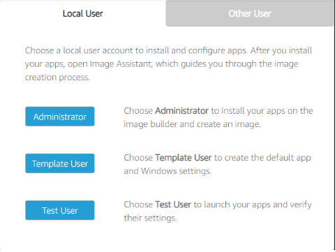

# AppStream Image Builder Guide 

### Who is this for?

You are trying to build a custom AppStream image with certain applications installed. 

### Requirements

Before going through these steps, you should have a basic idea of how AppStream functions. If you haven't already, checkout the [AppStream Developer Intro notebook](./AppStream-Developer-Intro.ipynb) for a brief overview of AppStream. 

### Overview

**Step 1**: Launch Image Builder from AWS Console 
- Choose a base image 
    - AppStream provides some base images to start off, with two OS options: Windows and Amazon Linux 2 
    - You may also start from images created by others where certain apps are already installed, such as Demo_Windows_Rclone for Windows or Demo_Conda for Linux 
- (Optional) Attach IAM role: If you would like to have access to other AWS services (like S3), attach an IAM role with the corresponding permissions. Then within the image builder, you can access those services with the profile name “appstream-machine-role" 
- Enable default network configuration 

Windows Image Builder Users: 

**Step 2**: Install Application as Admin 

- If Windows, select the Administrator User. If Linux, you are logged in as ImageBuilderAdmin by default. 
- Install desired applications (such as SLEAP) as you usually would  
- Reminder to install any packages / files in the root directory for Linux or disk C for Windows, but NEVER in any user directory.  
- To allow access to s3, install Rclone if not already installed (when building image from Appstream base image) 

**Step 3**: Add Application as Admin 

- In Image Assistant app, click “Add App” and start adding applications you would like to stream to users.  
- For typical desktop apps like Chrome and GitBash, you could select the executable file where you installed it, and the configurations would be autocompleted. For packages like Sleap and DeepLabCut that would be run from the terminal, you could select the Terminal App.  
- (Optional) Add path to icon if not autocompleted.  
- (Optional) For Windows, add launch parameters and the working directory for commands that would be run at the beginning whenever a user launches the app (such as activating a Conda environment) 

**Step 4**: Create default settings as Template User 

- If Windows, switch to Template User. If Linux, create a Template User as instructed in any Linux notebook. 
- Configure the default settings, such as setting environment variables, setting na default Conda environment. Default settings that you can create and configure include: 
    - Application preferences, including a browser home page, toolbar customizations, and security settings. 
    - Application data settings, including browser bookmarks and connection profiles. 
    - Windows experience settings, including displaying file name extensions and hidden folders. 

As a result of this step, users who launch instances from the resulting image won't need to configure these settings themselves and can get started with the applications quickly. 

**Step 5**: Copy default settings to Admin 

- If Windows, switch back to Admin User. If Linux, exit the Template User (and delete it). 
- In Windows Images, just click the “save settings” button in the Image Assistant app after switching back to an Admin, so that all configurations that were setup in Template User will be saved (and copied to Test user). 
- In Linux Images, follow instructions in [The Linux notebook](./Linux-Conda-Sleap-Rclone-Image.ipynb).  

**Step 6**: (Optional) Test Apps 

- If Windows, switch to Test User. If Linux, create a Test User, like a Template User.   
- Open the apps, check that everything works and the default settings are configured correctly 

**Step 7**: Optimize App Launch 

- In Image Assistant app under the Optimize tab, click “Launch” and the Image Assistant app will start launching the registered apps one by one 
- After each app starts, provide any required input and perform the first run experience for the app (e.g. launch the Sleap GUI once in the terminal). Then click “continue” to proceed to the next app. 

This is an automated process to perform optimizations to reduce the time that it takes for the application to launch for the first time on a new fleet instance. Upon each app launch, Image Assistant will automatically detect the files that should be optimized. This is a simple process if you are using the Image Assistant for this step. (If using AWS CLI, you would have to specify which files to optimize for.) 

**Step 8**: Create Image 

- Complete the details for the resulting image (e.g. name, description), then click `Disconnect and Create Image`.  
    - For description, you can describe the apps included and their versions. 
- The session will disconnect and may prompt you to retry the connection, but you are safe to close the browser tab now. The image is being created and the image builder stats will appear as “Snapshotting” in the AWS console. Once the snapshot is complete, the image builder will be “Stopped”, and the demo image you created will be in the Image Register, ready for use. 

 