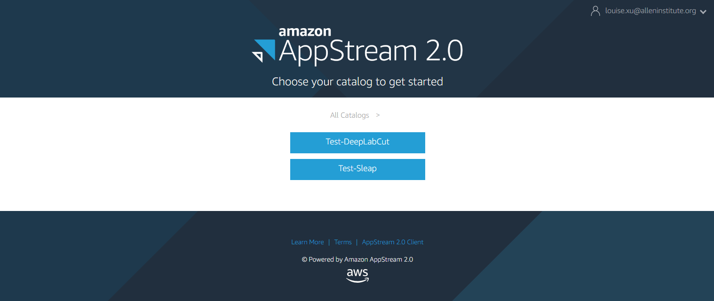
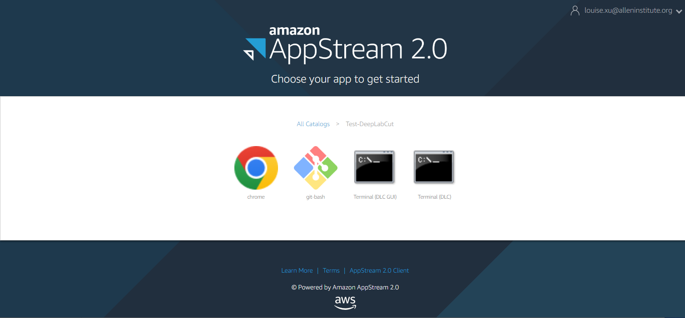
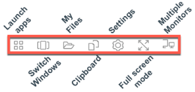
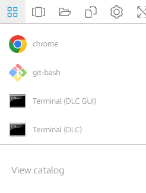

# AppStream User Guide for Animal Pose Estimation

### Who is this for?

You are trying to analyze imaging data hosted on Allen Institute for Neural Dynamics cloud buckets. 

### Requirements

Before going through these steps, you need to have an AppStream account which has access to the SLEAP stack and/or the DeepLabCut stack. If you don’t have an account, you may request one from the Allen Institute Neural Dynamics Scientific Computing team. 

### Overview

This guide explains how to use AWS AppStream to run SLEAP and/or DeepLabCut to analyze data stored in S3. 

**Step 1**: Log in to AppStream account


**Step 2**: Launch the desired application
    
Choose a catalog and select the "Terminal (GUI)" app to launch the Pose Estimation GUI

 

Alternatively, after entering the AppStream instance, you can click the “Launch apps” icon on the upper left toolbar (left figure) to list all the apps available (right figure) and select the app you want to launch. 

 

**Step 3**: (Optional) Upload files to AppStream 

- Click the My Files icon from the AppStream toolbar to open a window displaying the Home Folder and Temporary Folder. 
- Drag and drop files from local computer to either folder. Or use the Upload files button on the top right corner to upload files.   

Note that you can only upload files to the Home Folder or the Temporary Folder before moving them elsewhere. 

**Step 4**: Load data from S3 bucket

Follow instructions in the GUI to import video data. A test S3 data bucket is already mounted and available at `C:\s3-mount`, and it contains some sample videos for Sleap and DLC. This product is currently in the development phase, so only the test bucket is mounted. Once it is ready for deployment, common AIND s3 data buckets will be mounted under the `C:\` disk.

**Step 5**: Annotate Data and Save Results in Home Bucket

Perform analysis according to documentation and tutorials for SLEAP and DeepLabCut.  

Save any important results in the Home Folder and any temporary files in the Temporary Folder, both located under `C:\Users\PhotonUser\My Files`, or `D:\PhotonUser\My Files`.  


- The Home Folder is connected to an S3 bucket that is unique to each user, hence it should be used to store any files that are intended to last over sessions.  
- The Temporary Folder stores files that will get cleaned up after the session is complete. Files in this folder will no longer exist once you’ve logged out. 

You can either use the command line in Terminal to move files to the desired location, or you can run `explorer` command in the Terminal app to open a File Explorer window.  

**Step 6**: (Optional) Download results to local computer 

- Move any files you want to download to the Temporary Folder.  
- Click the My Files icon from the AppStream toolbar to open a window displaying the Home Folder and Temporary Folder.  
- Navigate to the file you want to download, click the drop-down button on the right end, and select download.  

Note that you are only able to download files but not folders in this window. If you would like to download a folder, first zip them (e.g. through File Explorer), move the zip file to Temporary folder (so it gets cleared when you log out), and download the zip file. 


### FAQ

**Where is the User home directory?**

It can be accessed via two routes, C:\Users\PhotonUser or D:\PhotonUser. This is where you can find your Desktop, Documents, Downloads etc. But remember that nothing in these folders (except the Home Folder) is guaranteed to be saved the next time you log in.  

**Why can’t I paste text inside AppStream?** 

When you first log in to AppStream and the browser prompts for clipboard permissions, click Allow. If you did not click Allow, or you clicked Allow but copy and pasting still doesn’t work, use the clipboard icon in the AppStream toolbar. Choose “Paste to remote session” or “Copy to local computer” according to your needs and follow its instructions. 

**What if the data I want to use isn’t available on AppStream?**

Contact the Scientific Computing team to mount the data for you (or [mount it yourself](#mount-s3-buckets)).

## Overview of applications installed in AppStream

#### Sleap GUI

After logging in, select the `Test-Sleap` catalog and choose the `Terminal (SLEAP GUI)` app, which launches the GUI automatically. Alternatively, choose the `Terminal (SLEAP)` app to open a terminal window, and enter the following command to launch the GUI:

```commandline
sleap-label
```

Follow the GUI guidelines to proceed. More detailed guide through the Sleap GUI available [here](https://sleap.ai/tutorials/tutorial.html). 

#### DeepLabCut GUI

After logging in, select the `Test-DeepLabCut` catalog and choose the `Terminal (DLC GUI)` app, which launches the GUI automatically. Alternatively, choose the `Terminal (DLC)` app to open a terminal window, and enter the following command to launch the GUI:

```commandline
python -m deeplabcut
```

Follow the GUI guidelines to create a project. The default location of new projects is the User Desktop `D:\PhotonUser/Desktop`, so remember to move your files to Home Folder before leaving. It is recomended to move the files before creating the training dataset so you can run training in Home Folder. You could also move the files before labeling the frames if you are worried about accidentally logging out during labeling. A tutorial of the DLC GUI is available in [this video](https://www.youtube.com/watch?v=KcXogR-p5Ak), and more details are available in [the DLC official webpage](https://deeplabcut.github.io/DeepLabCut/README.html)

NOTE: To add videos, click the `Browse videos` button to open the file selector window. Select the **folder** containing the video files, **NOT** the video file itself, then click `choose` to confirm. Now all video files in that container will be displayed in the GUI, only select the ones you will be analyzing. 

#### Git Bash

If you are not familiar with the Windows terminal commands and would like to use Linux commands (e.g. `ls` instead of `dir` to list files in directory), or if you would like to use git operations, you can also launch the Git Bash app. Remember to run `cd ~` first to get to the user home directory. However, Conda environments are only available in the Windows terminal app, so you would not be able to run sleap or deeplabcut through a Git Bash window. 

P.S. This would not be an issue after we switch to using Linux instead of Windows in the future. 

#### Chrome

This launches a Google Chrome browser window. This app may be removed in the future. 

### Mount S3 buckets in AppStream

If you would like to access certain S3 data buckets but they are not already mounted on the `C:\` disk, you may contact the Neural Dynamics Scientific Computing team. 

In case you would like to  mount additional S3 buckets on the file system by yourself, here is how you can do it.

The first option is to mount in the foreground with the following command. This mount process will then occupy the current console. Minimize this console and open another console to run other commands. Terminate the process by typing [ctrl] + [C] in the original console, or by closing the original console to unmount the bucket. Substitute MOUNT_PATH with the path to a non-existing folder name (i.e. you do not need to create the folder beforehand), for example the mount path for the appstream test bucket is `C:\s3-mount`.

```commandline
rclone mount s3:aind-appstream-data-dev-temporary MOUNT_PATH
```

The second option is to mount in the background using the first command below. The console will close immediately and you can open a new console to continue with other commands. Run the second command to unmount all buckets (CAUTION).

```commandline
rclone mount s3:aind-appstream-data-dev-temporary MOUNT_PATH --no-console

taskkill /F /IM rclone.exe
```
